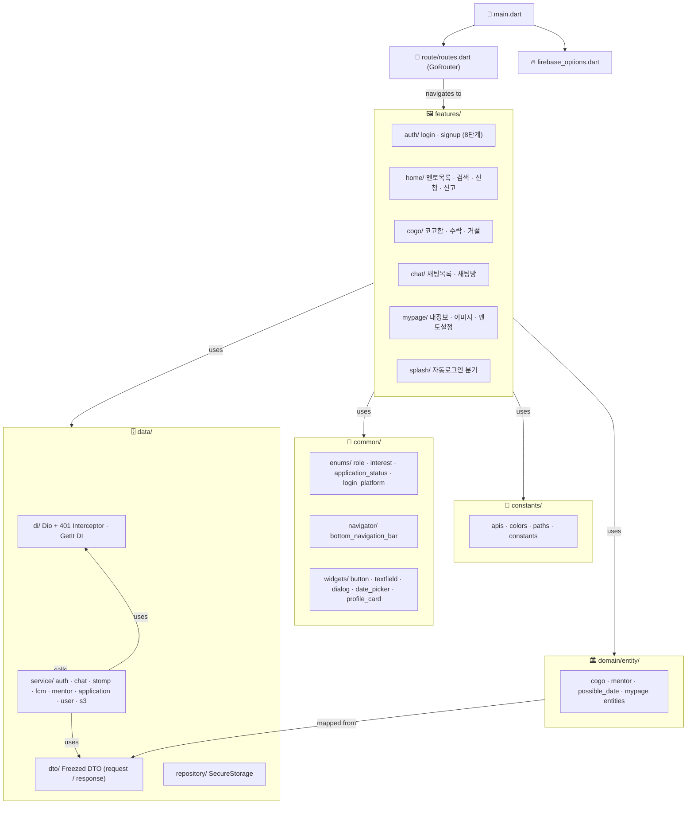

# COGO
<p align="center">
  
  
</p>


## Technology Stack
- **Framework**: Flutter, Dart
- **아키텍처**: MVVM + get_it 서비스 로케이터
- **상태관리**: Provider
- **라우터**: GoRouter
- **http** 통신: dio
- **JSON 직렬화/역직렬**화: freezed + json_serializable
- **Communication**: STOMP WebSocket


## Diagram


## 레이어 요약
```
  main.dart
   ├── constants/         ← 앱 전역 상수 (API 경로, 색상, 라우트명)
   ├── route/             ← GoRouter 라우팅 설정
   ├── common/            ← 공용 위젯(atoms→components), enum, util
   ├── data/
   │   ├── di/            ← Dio 클라이언트, GetIt 등록
   │   ├── dto/           ← Freezed DTO (request / response 도메인별 분류)
   │   ├── repository/    ← SecureStorage 로컬 저장
   │   └── service/       ← REST API, STOMP, FCM 호출
   ├── domain/entity/     ← 비즈니스 엔티티 (DTO와 분리)
   └── features/          ← 화면 + ViewModel (MVVM)
        ├── auth/          ← 로그인 / 회원가입 8단계
        ├── home/          ← 멘토 목록·검색·신청·신고
        ├── cogo/          ← 코고함 (수락/거절/매칭)
        ├── chat/          ← 채팅 목록 · 채팅방
        ├── mypage/        ← 내 정보·이미지·멘토 설정
        └── splash/        ← 자동 로그인 분기
```


## COGO Mobile Team

| 지선의 | 유진 | 윤영민 | 심상현 | 
|:--------:|:-------:| :-------:| :-------:| 
||  |  | 
| [sunnny619](https://github.com/sunnny619) | [HI-JIN2](https://github.com/HI-JIN2)  | [DevDAN09](https://github.com/DevDAN09) | [halfmoon-mind](https://github.com/halfmoon-mind)|
| Flutter Engineer | Flutter Engineer  | Project Manager | Outer Reviwer
